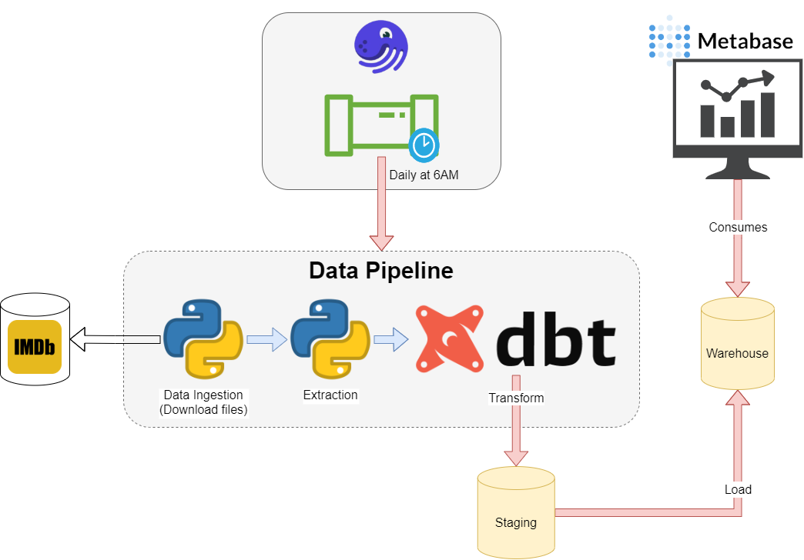
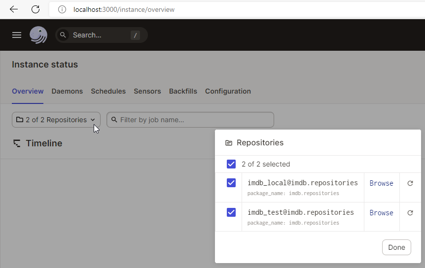
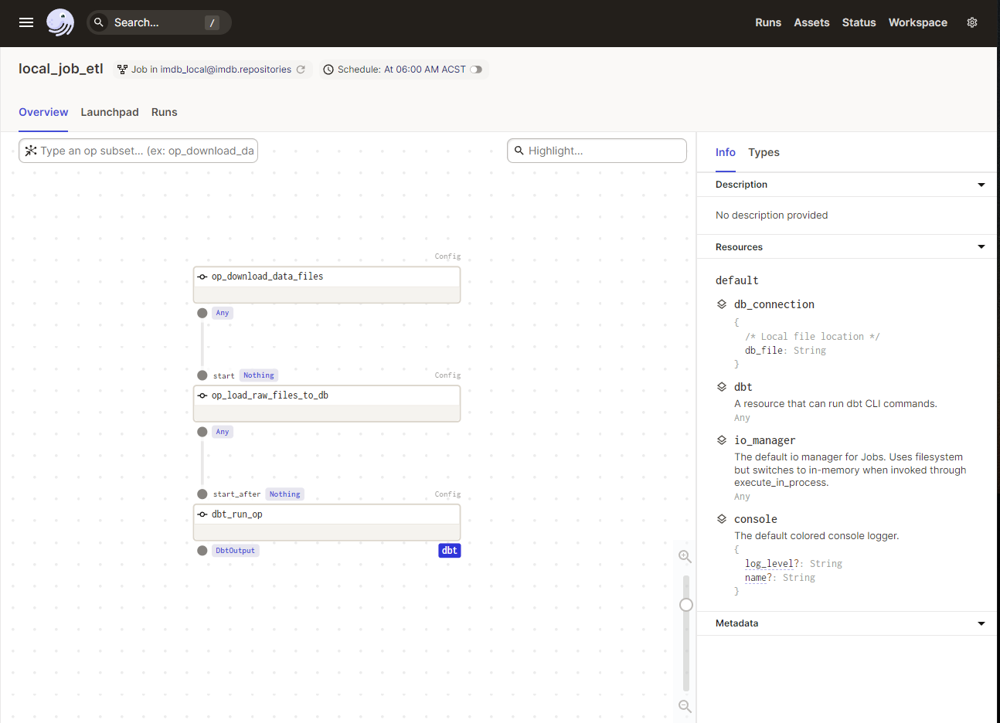
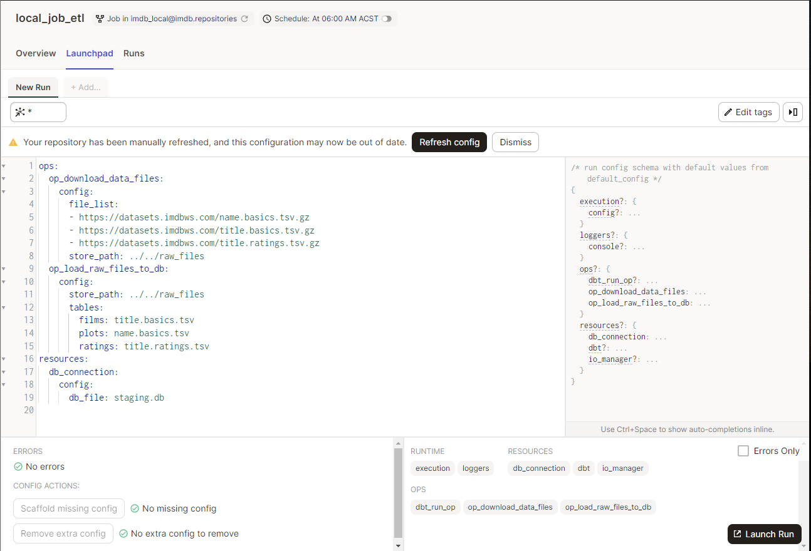
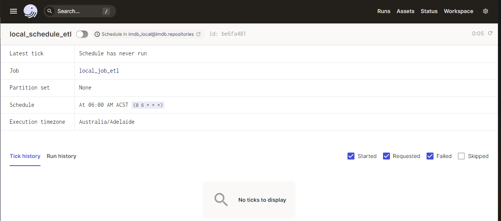
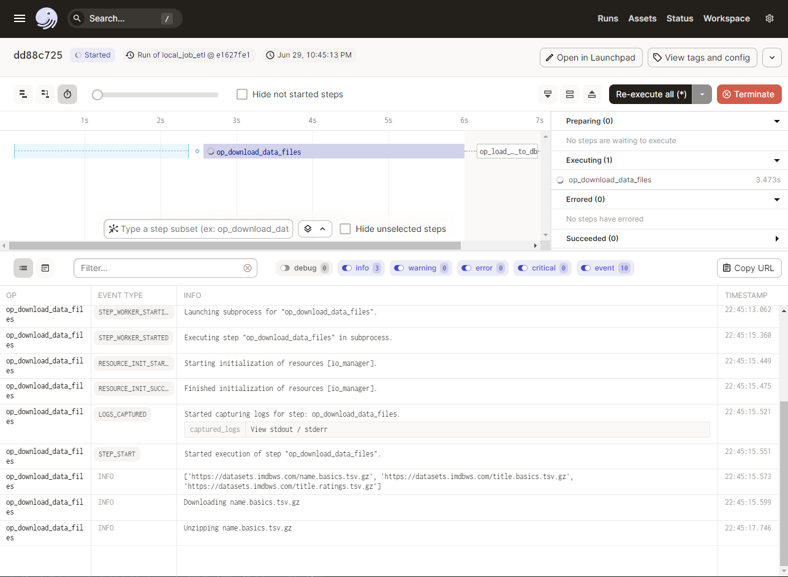
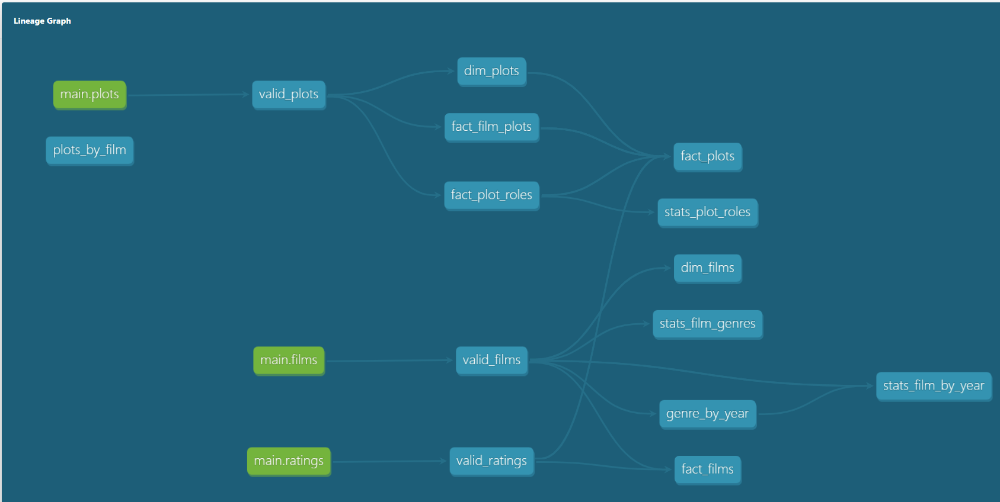
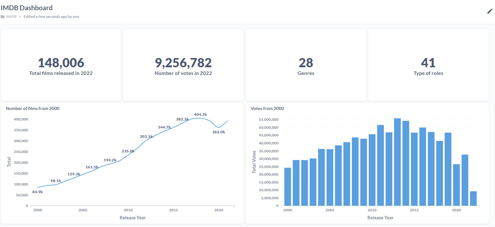

# Dagster & DBT simple example

By the time of the first commit of this project, I have worked at AnglicareSA, a not-for-profit organisation, for a year. This project is inspired by the article ["The Unbundling of Airflow"](https://blog.fal.ai/the-unbundling-of-airflow-2/) by Gorkem Yurtseven at Fal.ai. I have finished a prototype at my organisation with the same structure as in this project. But, I used the actual data in the org system for that prototype. It is the reason I cannot share the prototype straight away but create this project with open data, which is IMDB.

Imagine you have these constraints for your system to run a data warehouse: Windows servers only, everything must run on-premise, and commercial or cloud-based tools may be unaffordable. Or, you are just a student who wants pursue a career as a Data Engineer and just don't want to spend too much time on learning and setting up a whole architecture on cloud. Cloud services setup sometimes is not for everyone and can hinder you from learning something quickly. For those reasons, I have come up with this architecture as a personal, easy-to-setup architecture. 

[Dagster](https://dagster.io/) is the best alternative to Airflow, which only runs on Linux, and really easy to setup to run locally on a Windows machine. It has cool features for automating jobs such as Schedules, Sensor, Partitions, and Backfills. I used a simple idea for the data pipeline in IMDB project that comprises 3 steps:
1.  Downloading 3 zip files from IMDB.
2.  Load them to a staging database.
3.  Trigger DBT operation to transform data in the staging and load final result to final database, considered a Data Warehouse. 

The project also demonstrates how to parameterise connections, configure tasks, and schedule a job in Dagster. The project merely uses Schedule feature, but you add a new scenario to use the Sensor feature where job now listens to changes of an SFTP/FTP/folder to trigger the pipeline.

[DBT](https://www.getdbt.com/) is the rising star in Data Transformation. If you're a Data Analyst, a Data Engineer, or a Data Scientist, SQL is compulsory right?! Instead of using low-code solutions like SSIS/Azure Data Factory that don't show you the actual transformation logic and requires triggering the pipeline to debug and view intermediate output, DBT is like an SQL template engine where you can compile, debug, test, and run your SQL statements. You know exactly what will happen in the Data Transformation step regardless of ETL or ELT. What if a Data Analyst has a new idea for their BI report and doesn't want to bother you with implementing the transformation logic for them? They can test their logic in SQL Management studio and ask you to put it into the DBT project, or they just do it themselves :). The beauty here is Data Analyst would be able to collaborate on a data pipeline development. Moreover, DBT has a built-in documentation generator so that you can make your work more transparent to your colleagues. The documentation site even generates a model lineage! Have you ever had to take over an SSIS project and asked yourself where to start to fix a model in a package? If the answer is yes, you'll definitely love DBT's documentation site.

Here is the screenshot of this architecture. You can install your favourite Python packages to this project and play with it. As I didn't want to write too much code for SQLite and want my logic portable, I used SQLalchemy and pandas for data extraction. It means you can replace SQLite with your selected one with very less code changes. Some ideas couldn't be implemented due to using SQLite. Descriptive Statistics tables were there because Metabase's SQLite driver or implementation is just wonky.


## **Dataset**
This example uses datasets that are shared by IMDB for non-commercial and personal use. You can find more about its license [here](https://www.imdb.com/interfaces/).

## **Prerequisites**
- Visual Studio Code
- Python 3.9.x
- Docker Desktop (Community Edition)

## **Folder structure**
- Dagster project is put into "imdb" folder.
- DBT project lives in "imdb_dbt". 
- "raw_files" folder will be generated when the "setup.ps1" script is running. 
- "metabase" stores information of the IMDB Dashboard and Questions. It also stores the account to access to Metabase as it doesn't have a default account. Please use this username and password to login: ```admin@metabase.local:config1```.

## **Setup**

Please follow these steps:
- Setup virtual environment and required package installation.

```
.\setup.ps1
```

- Start Dagster Daemon and UI. You should see the UI server hosted at port 3000

```
.\start_dagster.ps1
```

- Run this script to generate the documentation site that shows model lineage and models' description. Note that, You should run this tool after running the data pipeline in Dagster UI.
```
.\start_dbt_doc.ps1
```

- Run Metabase. Note that, You should run this tool after running the data pipeline in Dagster UI.
```
.\start_metabase.ps1
```

After starting Dagster, please go to ```localhost:3000```. You should see 2 repositories like in the screenshot. 


Then choose "local_job_etl" job from "imdb_local". Select "Launch Pad" tab, then you'll see the configuration of this job and its scheduled time.



When you click on "Schedule: At 06:00 ACST", you'll see the details of this scheduled task like in the screenshot below.


Go back to the previous screen and trigger the pipeline. Dagster will move to the job run details page as this screenshot.


Now go run ```start_dbt_doc.ps1``` script and go to ```localhost:8080``` to see information of staging and final models as well as the model lineage as in the screenshot below.


Next please run ```start_metabase.ps1``` script to start Metabase. Please start Docker prior to this step. Go to ```localhost:50000``` then use the credential given in ```Folder structure``` section to login. Click on "IMDB" then "IMDB Dashboard" to view the dashboard as below.

